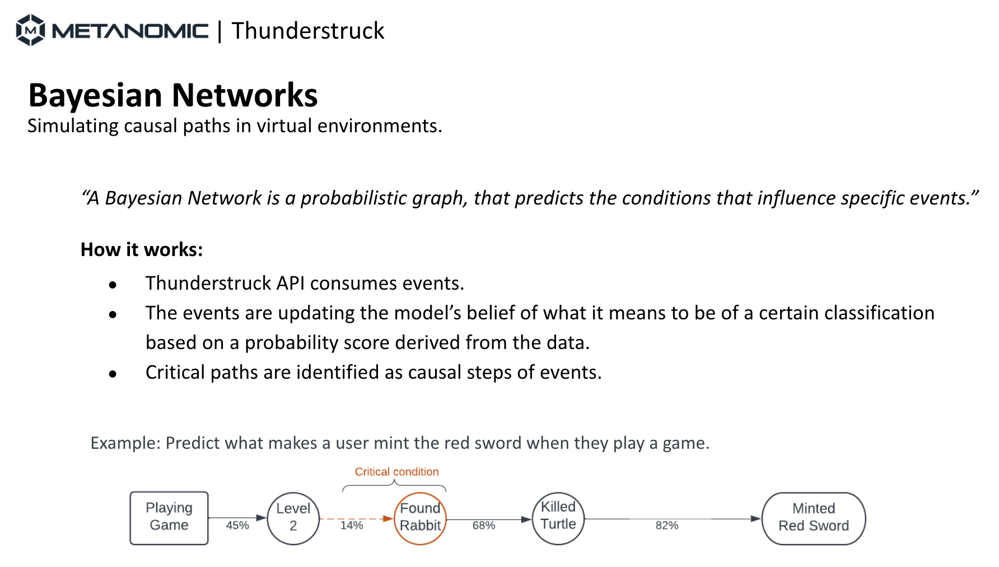

## Thunderstruck paradigms | On synthetic data 

This public repository is meant as a showcase of the Metanomic's Thunderstruck product on synthetic data. The data that have been used are fabricated by the Metanomic team, influenced by the mechanics of each example.

For the purpose of this showcase we are using the below examples:

- Minecraft
- Clash Of Clans
- Web3
- DOTA 2
- Dual Universe
- GTA
- The Sims
- The Last Of Us
- The Witcher

In each example we are focused on Neurosymbolic algorithms based on Bayesian Networks that allow for:
- Users' classification based on behavior
- Bayesian event-chains (explained in the image below)

 

  

## What is Thunderstruck

Thunderstruck is a data and player classification and categorisation tool for any game, platform, or digital environment. Thunderstruck helps you to understand and segment players better, enhance LiveOps, increase ad monetisation, and make more informed decisions around your users.

With Thunderstruck API, you can send your first-party in-gaming data, as events as they happen within the virtual world. “Virtual World” is Metanomic’s generic word for any digital application, game or metaverse you own, on any kind of a platform; website, mobile app, and processes that run on a server or OTT device.

When Thunderstruck generates the category insights, based on your interaction data, you can send it (often in real-time) to your marketing, product, and analytics (BI) tools, as well as to data warehouses.
