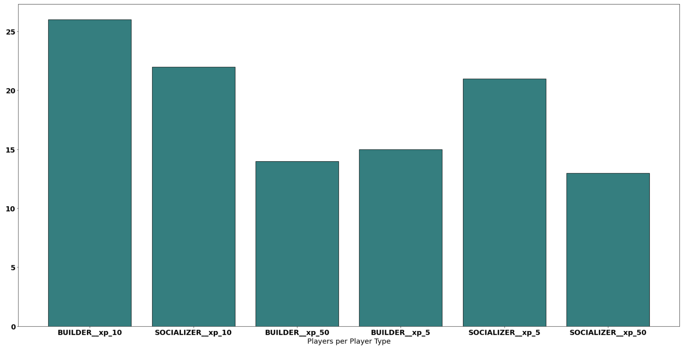
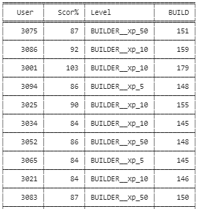
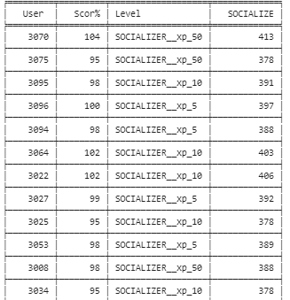

# Dual Universe | Thunderstruck Tables

## Classifications:
- Builder
- Socializer

 
Sum of users per Classification
 

  

 
Classification of users per XP Level
 

  

## Builders Table

 

  

## Socializers Table

 

  

