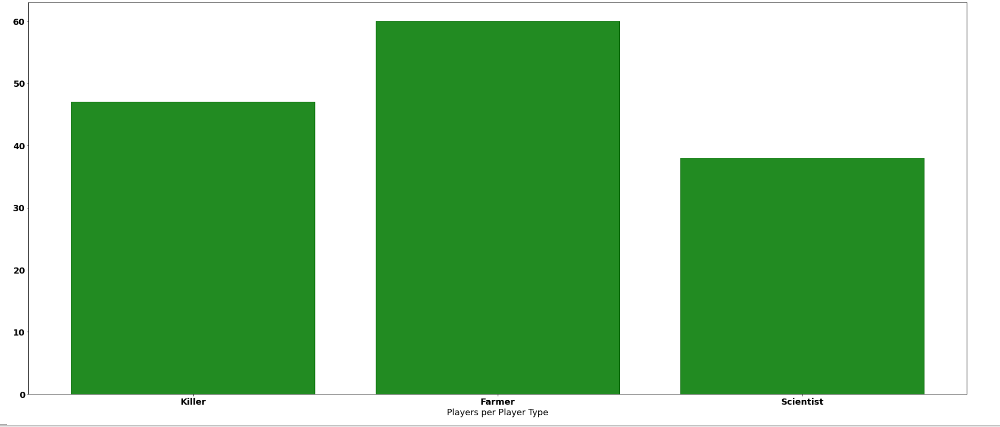
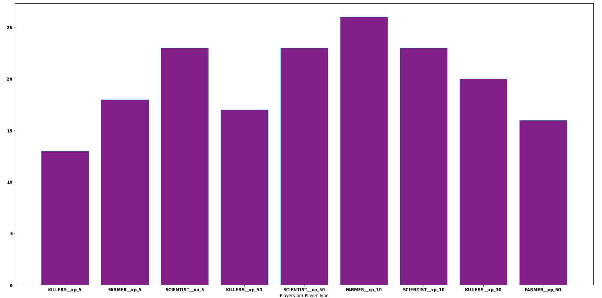
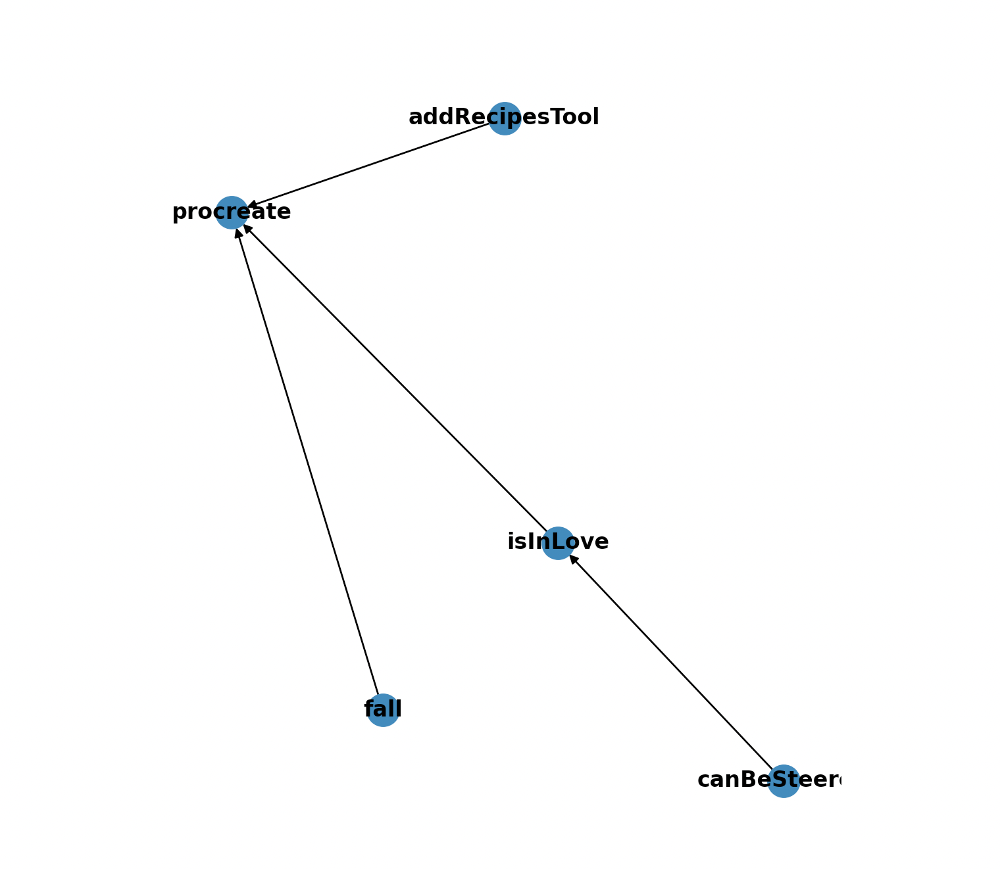
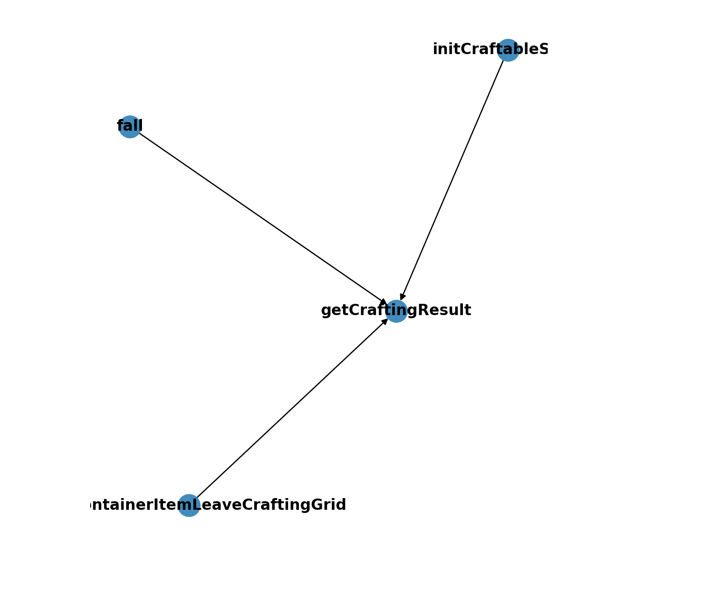

# Minecraft | Thunderstruck Tables & Bayesian Chains

## Classifications:
- Farmers
- Killers
- Scientists

Sum of users per Classification

 

  

Classification of users per XP Level

 

  

## Farmer Event Chain

 

  

## Killer Event Chain

 

  

## Scientist Event Chain

 

  

