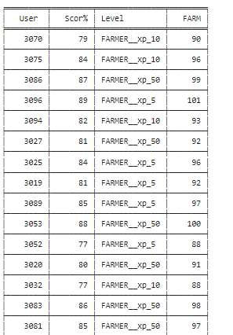
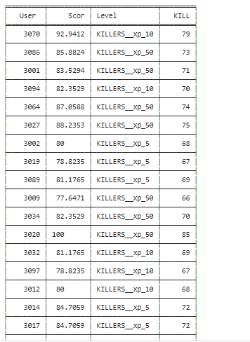
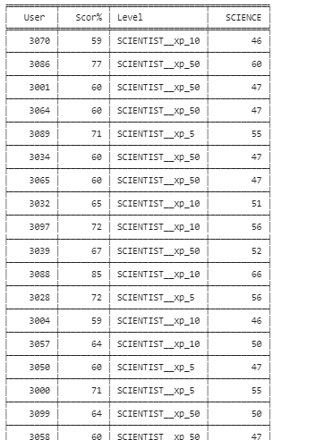

# Minecraft | Thunderstruck Tables & Bayesian Chains

## Classifications:
- Farmers
- Killers
- Scientists

 
Sum of users per Classification
 

  

 
Classification of users per XP Level
 

  

## Farmer Event Chain
Paths:
1. "canBeSteered" --> "isInLove" --> "procreate"
2. "addRecipesTool" --> "procreate"
3. "fall" -- > "procreate"
 

  

## Killer Event Chain
Paths:
1. "getEntityToAttack" --> "findPlayerToAttack" --> "onKillEntity"
2. "fall" --> "onKillEntity"
3. "doesContainerItemLeaveCraftingGrid" --> "onKillEntity"
 

  

## Scientist Event Chain
Paths:
1. "initCraftableStats" --> "getCraftingResult"
2. "doesContainerItemLeaveCraftingGrid" --> "getCraftingResult"
3. "fall" --> "getCraftingResult"
 

  

## Farmers Table

 

  

## Killers Table

 

  

## Scientists Table

 

  

