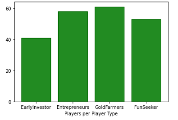
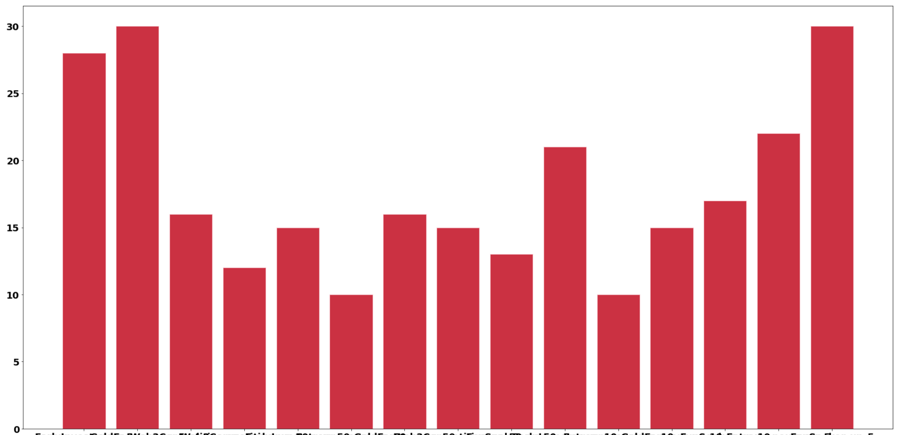

# Web3 | Thunderstruck Tables

## Classifications:
- Early Inventory
- Gold Farmer
- Competitive
- Entrepreneur
- FunSeeker

Sum of users per Classification

 

  

Classification of users per XP Level

 

  

The order of columns:

EarlyInventory_xp_5, 
GoldFarmer_xp_5, 
Web3Competitive_xp_5, 
EarlyInventory_xp_10 ,
GoldFarmer_xp_10, 
Web3Competitive_xp_10, 
Entrepreneurs_xp_5 , 
FunSeeker_xp_5 , 
EarlyInventory_xp_50 , 
GoldFarmer_xp_50, 
Web3Competitive_xp_50, 
FunSeeker_xp_50, 
FunSeeker_xp_10, 
Entrepreneurs_xp_10, 
Entrepreneurs_xp_50
