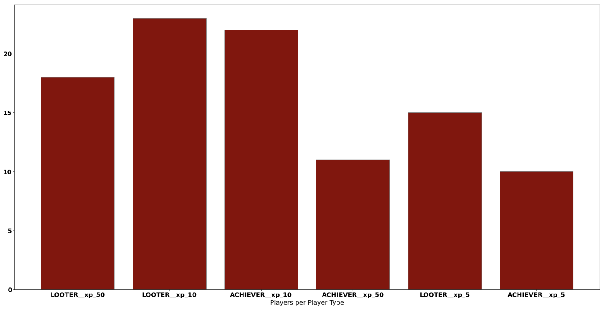

# The Witcher | Thunderstruck Tables

## Classifications:
- Looter
- Achiever

 
Sum of users per Classification
 

  

 
Classification of users per XP Level
 

  

## Achievers Table

 

  

## Looters Table

 

  

